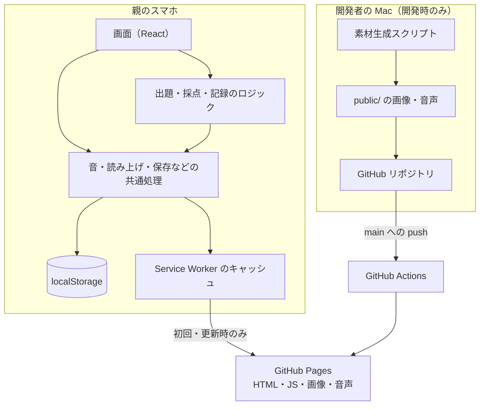

# アーキテクチャ設計書

前提：[product-requirements.md](./product-requirements.md)、[functional-design.md](./functional-design.md)。

## 1. 全体構成
サーバーを持たない静的な PWA。アプリは端末のブラウザの中だけで動き、実行中に外部へ通信しない。イラスト・音声などの素材は、開発者の Mac で事前に生成してリポジトリに含める。

## 2. 技術スタック
| レイヤー | 技術 | バージョン | 選定理由 |
|---|---|---|---|
| 言語 | TypeScript | 6.0 | 問題の形がカテゴリごとに違うため、型で取り違えを防ぐ |
| フレームワーク | React | 19 | 画面の状態管理と部品化。開発者・AI ともに扱い慣れている |
| アニメーション | framer-motion | 13 | 正解演出・キャラクターの動き・画面切替を短く書ける |
| ビルド | Vite | 8 | 起動とビルドが速い。PWA 用プラグインがある |
| PWA | vite-plugin-pwa | 1.3 | Service Worker とマニフェストを生成し、オフライン動作と自動更新を実現する |
| データストア | localStorage | － | サーバーを持たない方針（[PRD 7](./product-requirements.md#7-スコープ外やらないこと)）。保存量が小さい |
| 音声再生 | Web Audio API／Web Speech API | － | 事前に作った音声ファイルの再生と、ないときの代わりの読み上げ。効果音・BGM は Web Audio で合成する |
| ホスティング | GitHub Pages | － | 無料で静的サイトを配信できる |
| CI/CD | GitHub Actions | － | main への push で自動ビルド・公開する |
| テスト | Vitest、Testing Library、jsdom | 4／16／30 | Vite と設定を共有でき、ロジックと部品を素早く試せる |
| リント | oxlint | 1.75 | 高速。React Hooks の規則違反を検出する |
| 素材生成（開発時のみ） | SDXL 系モデル（ローカル、Python）、Gemini API、VOICEVOX、Kokoro、Piper | － | イラスト・音声を事前生成し、実行時の費用と通信をなくす。Gemini API は高い品質が必要なキャラクターデザインにだけ使い、それ以外の画像はローカルの SDXL 系モデルで作る |

## 3. 構成要素と責務
| コンポーネント | 責務 | 依存先 |
|---|---|---|
| App（画面の切替） | 現在の画面と「もどる」の履歴を持ち、画面を切り替える。学習記録を読み込み、セット終了時に保存する | screens、domain/progress、lib/storage |
| screens（画面） | 各画面の表示と操作。ホーム・入口・レベル選択・クイズ・結果・なぞり書き・保護者ゲート・進み具合 | components、domain、lib、i18n |
| components（部品） | 画面をまたいで使う表示部品。キャラクター、正解演出、時計、まちがいさがしの盤面、手書きキャンバス、画面の縮小表示など | lib、i18n |
| domain（ドメイン） | 出題範囲のデータ（文字・漢字・単語・場面など）、カテゴリごとの問題の生成、採点、レベルアップ、復習、重複回避。画面と React には依存しない | lib の純粋な関数（乱数など）と保存処理、i18n の辞書のキー（詳細は [repository-structure.md](./repository-structure.md#3-配置ルール)） |
| lib（共通処理） | 読み上げ、効果音、BGM、localStorage への保存、乱数、書き順の照合、タップ演出 | ブラウザの API |
| i18n（多言語） | 日本語・英語の表示文字列と、言語の切替 | lib/storage |
| styles（スタイル） | 色・大きさなどのテーマと、共通の見た目 | － |
| public（静的素材） | イラスト・キャラクター・音声・書き順データ・PWA アイコン | － |
| scripts（開発用スクリプト） | イラスト・音声・書き順データの生成と検査。アプリには含めない | 開発者の Mac 上のモデル・外部 API |

## 4. データフロー
**1セット遊ぶ流れ**
1. 起動時に App が localStorage から学習記録を読み込む（読めない部分は初期状態にする）。
2. レベルを選ぶと、domain がそのカテゴリの記録（復習リスト・直近に出した問題）を使って1セット分の問題を作る。
3. クイズ画面が1問ずつ表示し、lib の読み上げで問題を読む。読み上げは `public/audio/` の事前音声を優先し、なければ端末の音声合成を使う。
4. 回答ごとに正誤を判定し、演出と効果音を出す。回答記録は画面の中だけで持つ。
5. セット終了時に domain が結果（正答率・連続正解・レベルアップ）と新しい記録を計算し、App が localStorage に保存して結果画面を出す。

**素材の流れ（開発時）**
1. 開発者の Mac で `scripts/` のスクリプトを実行し、イラスト・音声を作る。キャラクターデザインは Gemini API、それ以外のイラスト（単語の絵、まちがいさがし、ごほうび、キャラクターの差分画像など）はローカルの SDXL 系モデル、音声は VOICEVOX などで作る。
2. 出来上がった素材を目で確認し、使うものだけを `public/` に置く。
3. 素材の一覧を TypeScript のデータファイル（例：`src/domain/spotScenes.ts`）として生成し、アプリから参照する。

## 5. 非機能要件への対応
- 性能：
  - 出題・採点は端末内の計算だけで行い、通信を待たない。
  - 正解演出は約1.5秒以内に終わり、`pointer-events: none` で操作を妨げない。
  - 画像は表示サイズに合わせて縮小して置く。
- セキュリティ（認証・認可・秘密情報の扱い）：
  - アプリにはログインもサーバーもない。
  - 保護者向けの画面は、計算の保護者ゲートで子どもの操作から守る。
  - 素材生成で使う API キー（`GEMINI_API_KEY`）は `.env` に置き、Git に含めない。アプリには含めない。
  - VOICEVOX などローカルの音声エンジンへの問い合わせは、開発環境（localhost）でだけ行う。公開版からは問い合わせない。
- 可用性・障害時の振る舞い：
  - Service Worker が画面・画像・音声をキャッシュし、オフラインでも動く。新しい版は自動で更新する。
  - 画面の描画で例外が起きても、エラー境界がアプリ全体を止めずに復帰の手段を出す。
  - 保存データが壊れていても、該当カテゴリを初期化して起動を続ける。
  - 音声を再生できなくても、操作は先へ進める。
- 画面サイズ：
  - スマートフォンの縦画面に特化する。PWA のマニフェストでも縦向き（portrait）を指定する。横画面・タブレット・PC 向けの専用レイアウトは作らない。
  - どの端末でもスクロールが出ないよう、画面が収まらないときは画面全体を縮小して表示する（FitToViewport）。
- 拡張性：
  - カテゴリを足すときは、domain に問題の生成を、`categoryMeta` に表示情報を足す。画面の部品は使い回す。
  - 保存データの新しい項目は任意の項目として足し、古い保存データでも読めるようにする。

## 6. 外部サービス・依存関係
| 名前 | 使う場面 | 実行時に必要か | 備考 |
|---|---|---|---|
| GitHub（リポジトリ・Actions・Pages） | ソース管理・ビルド・配信 | 初回読み込みと更新のときだけ | 無料の範囲で使う |
| Gemini API | キャラクターデザイン（案内キャラクターの立ち絵）の生成だけ | 不要（開発時のみ） | `GEMINI_API_KEY` が必要。費用がかかるため、高い品質が必要なキャラクターデザイン以外には使わない |
| SDXL 系モデル（RealVisXL、DreamShaper XL Lightning） | キャラクターデザイン以外のすべての画像（単語の絵、まちがいさがしの場面・違い、ごほうび、キャラクターのまばたきなどの差分） | 不要（開発時のみ） | 開発者の Mac 上で動かす（Apple Silicon）。1枚あたりの費用がかからない |
| VOICEVOX（ローカル） | 日本語の読み上げ音声の事前生成 | 不要（開発時のみ） | 開発中は localhost で直接呼ぶこともある |
| Kokoro／Piper（ローカル） | 英語の読み上げ音声の事前生成 | 不要（開発時のみ） | 同上 |
| KanjiVG などの書き順データ | なぞり書きの書き順 | 不要（取り込み済み） | 開発時にスクリプトで取得してリポジトリに含める |

## 7. 環境構成
| 環境 | 用途 | URL／場所 |
|---|---|---|
| local | 開発・動作確認（`npm run dev`） | http://localhost:5173/kids-study-app/ |
| production | 子どもが使う本番 | https://japanesehata-cpu.github.io/kids-study-app/ |

本番へは `main` ブランチへの push で GitHub Actions が自動でビルド・公開する。ステージング環境は持たない。

## 8. 設計上の判断記録（ADR）
| 判断 | 選択肢 | 採用理由 |
|---|---|---|
| 配布形態 | ネイティブアプリ／PWA | ストア審査も費用も不要で、親のスマホのホーム画面に追加できる PWA を採用 |
| データの保存先 | サーバー＋DB／端末内（localStorage） | 子ども1人・端末1台で同期の必要がなく、外部送信もしない方針のため端末内を採用 |
| 素材の作り方 | 実行時に生成／事前に生成して同梱 | 実行時の費用・通信・待ち時間をなくし、内容を親が確認してから出すため、事前生成を採用 |
| 読み上げ | 端末の音声合成のみ／事前音声を優先 | 端末の音声は不自然で読み間違いもあるため、固定の文は事前に作った音声を優先し、それ以外だけ端末の音声合成にする |
| 対象の画面の向き | 縦・横の両対応／縦画面に特化 | 親のスマホを縦に持って子どもに渡す使い方のため、縦画面に特化して作り込む。両対応にする手間をかけない |
| 画像生成のモデル | すべて Gemini API／すべてローカル／使い分け | 費用を抑えるため、ローカルの SDXL 系モデルを基本にする。キャラクターはアプリの顔で何度も目にし、ローカルモデルでは品質が足りないため、キャラクターデザインだけ Gemini API を使う |
| 画面が収まらないとき | スクロール／全体を縮小 | 子どもはスクロールに気づかないため、スクロールをなくし、全体を縮小して1画面に収める |
| 問題の作り方 | 固定の問題集／その場で生成 | 飽きないよう、出題範囲のデータからその場で組み立てる。復習と直近の重複回避を加える |
