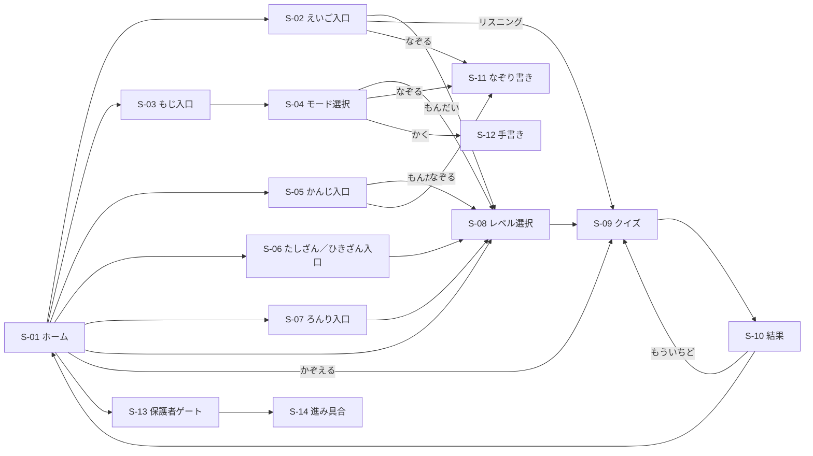
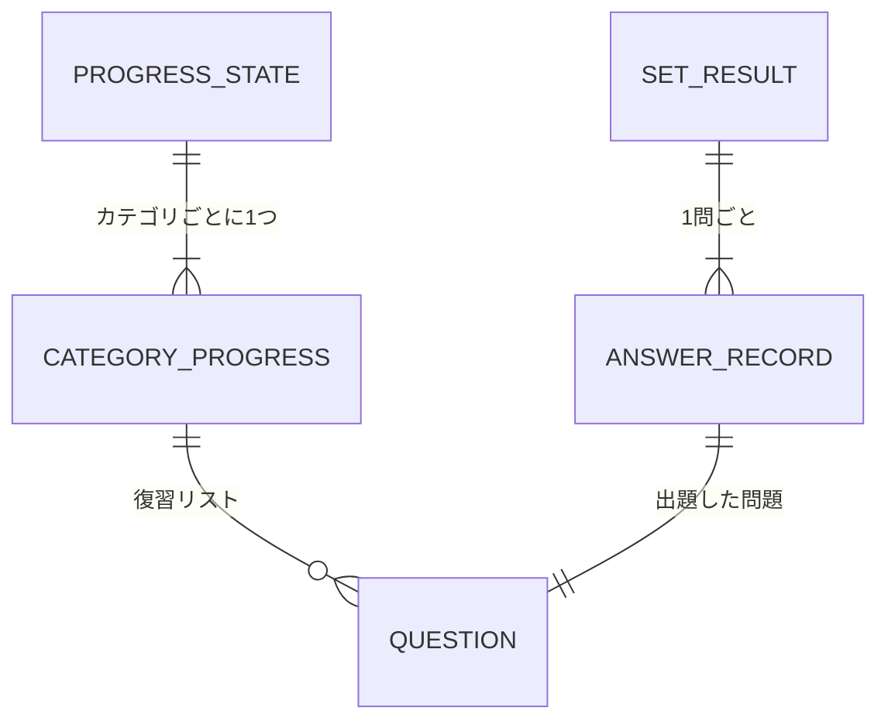
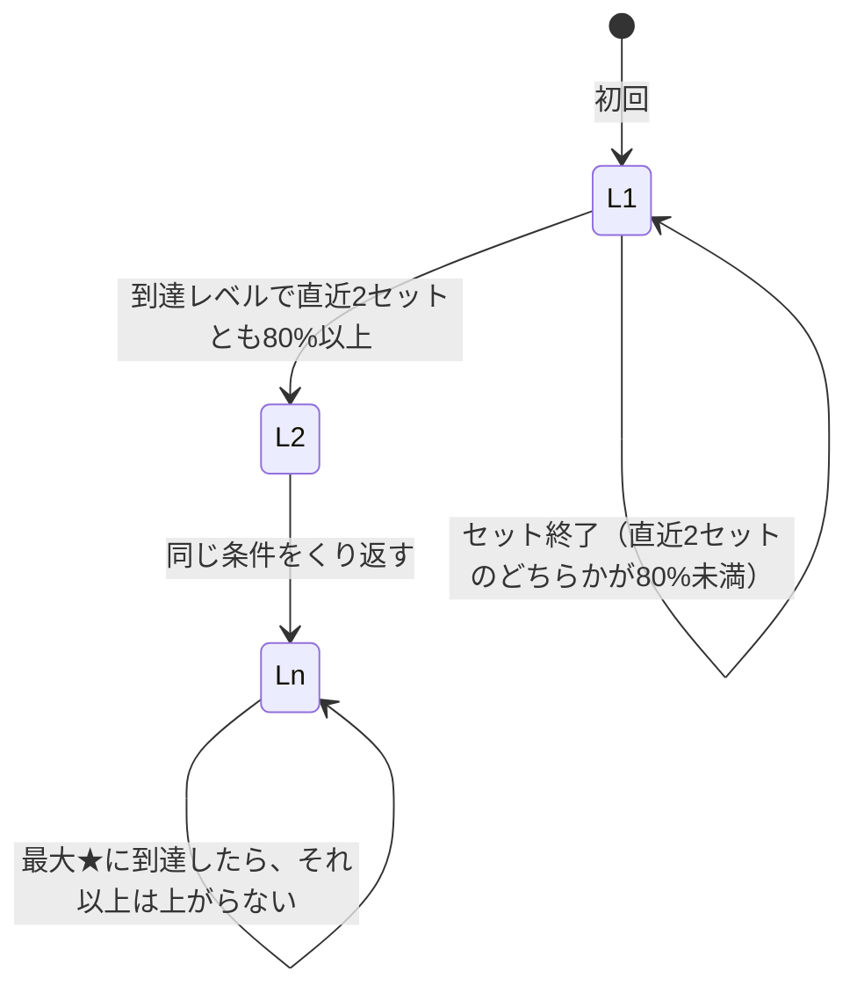

# 機能設計書

前提：[product-requirements.md](./product-requirements.md)。技術的な実現方法は [architecture.md](./architecture.md) を参照。

## 1. 機能一覧
PRD の機能要件（F-xx）との対応を示す。

| PRD ID | 機能 | 概要 | 本書の節 |
|---|---|---|---|
| F-01 | ホームとカテゴリ選択 | カテゴリのカード、挨拶、言語・音・設定の操作 | [3.1](#31-f-01ホームとカテゴリ選択) |
| F-02 | レベル選択 | ★レベルとセットの問題数を選ぶ | [3.2](#32-f-02レベル選択) |
| F-03 | クイズ出題と回答 | 1セット分の出題・判定・復習・重複回避 | [3.3](#33-f-03クイズ出題と回答) |
| F-04 | 算数カテゴリ | たしざん・ひきざん・□を求める・とけい・おかね・かぞえる | [3.4](#34-f-04f-06カテゴリ別の出題内容) |
| F-05 | ことばカテゴリ | ひらがな・カタカナ・アルファベット・漢字・えいご | [3.4](#34-f-04f-06カテゴリ別の出題内容) |
| F-06 | 考える力カテゴリ | ろんり・まちがいさがし・すうどく | [3.4](#34-f-04f-06カテゴリ別の出題内容) |
| F-07 | なぞり書き・手書き | 文字・漢字・単語のなぞり、手書き | [3.5](#35-f-07なぞり書き手書き) |
| F-08 | 音声読み上げ | 問題・選択肢・正解・ほめ言葉の読み上げ | [3.6](#36-f-08音声読み上げ) |
| F-09 | 正解・不正解の演出 | はなまる・紙吹雪・効果音・連続正解 | [3.7](#37-f-09正解不正解の演出) |
| F-10 | 結果画面 | 正解数ぶんの★、得意・苦手、レベルアップ | [3.8](#38-f-10結果画面) |
| F-11 | 学習記録 | カテゴリごとのレベル・成績・復習を端末に保存 | [3.9](#39-f-11学習記録とレベルアップ) |
| F-12 | 保護者ゲートと進み具合 | 計算で保護された進み具合の画面 | [3.10](#310-f-12保護者ゲートと進み具合) |
| F-13 | キャラクターと没入演出 | 案内キャラクター、画面切替、タップ演出、BGM | [3.11](#311-f-13キャラクターと没入演出) |
| F-14 | 日本語・英語の表示切替 | 画面の表示言語を切り替える | [3.12](#312-f-14日本語英語の表示切替) |
| F-15 | オフライン利用・ホーム画面追加 | PWA としてインストール・オフライン動作 | [3.13](#313-f-15オフライン利用ホーム画面追加) |

## 2. 画面設計
### 画面一覧
| 画面ID | 画面名 | 役割 |
|---|---|---|
| S-01 | ホーム | カテゴリのカードを並べる入口。挨拶、言語切替、BGM 切替、保護者ゲートへの入口 |
| S-02 | えいごの入口 | えいたんご（よむ／きく）・えいごリスニング・単語なぞりを選ぶ |
| S-03 | もじの入口 | ひらがな・カタカナ・アルファベットを選ぶ |
| S-04 | もじのモード選択 | 選んだ文字種で「もんだい」「なぞる」「かく」を選ぶ |
| S-05 | かんじの入口 | 学年（1年・2年）と「もんだい」「なぞる」を選ぶ |
| S-06 | たしざん／ひきざんの入口 | 「けいさん」と「□をもとめる」を選ぶ |
| S-07 | ろんりの入口 | 「ろんり」と「すうどく」を選ぶ |
| S-08 | レベル選択 | ★レベル、セットの問題数（5もん／10もん）、カテゴリ固有のモードを選ぶ |
| S-09 | クイズ | 1問ずつ出題し、回答を判定して演出する |
| S-10 | 結果 | セットの結果を表示する |
| S-11 | なぞり書き | ひらがな・カタカナ・アルファベット・漢字・単語をなぞる |
| S-12 | 手書き | お手本なしで文字を書く |
| S-13 | 保護者ゲート | 2けた＋2けたの足し算に正解した人だけ先へ進める |
| S-14 | 進み具合 | カテゴリごとの到達レベルと最近の成績を表示する |

### 画面遷移
すべての画面（ホーム以外）に「もどる」（1つ前の画面）と「ホームへ」を置く。

## 3. 機能詳細

### 3.1 F-01：ホームとカテゴリ選択
- 目的：子どもが迷わず遊ぶカテゴリを選べるようにする。
- 前提条件：なし（起動直後に表示する）。
- 処理フロー：
  1. カテゴリのカードを並べる。表示するのは、たしざん・ひきざん・えいご・ろんり・もじ・かんじ・とけい・まちがいさがし・かぞえる・おかね。その他のカテゴリは各入口画面の中からたどる。ずけい（shapes）は品質が整うまでどこからも表示しない。
  2. 1回の起動につき最初の1回だけ、時間帯（朝・昼・夜）に合わせた挨拶を吹き出しで出し、キャラクターの声で読み上げる。
  3. 上部の1行に、言語切替（国旗）、BGM のオン・オフ、保護者ゲートへの入口（設定アイコン）を置く。
- 入力／出力：カードのタップ → 該当カテゴリの入口画面・レベル選択・クイズへ遷移する。
- エラー時の振る舞い：音声の再生が端末に止められている場合は、最初のタップの後に挨拶を読み上げる。
- 受け入れ条件：
  - [ ] スマートフォン縦向きで、スクロールせずにすべてのカードと操作が1画面に収まる
  - [ ] 挨拶は1回の起動につき1回だけ出る（クイズから戻っても再度出ない）

### 3.2 F-02：レベル選択
- 目的：子どもの今の力に合った難しさと長さで遊べるようにする。
- 前提条件：カテゴリが決まっている。
- 処理フロー：
  1. そのカテゴリの★1〜最大レベル（カテゴリごとに3〜6）のボタンを並べ、各レベルの内容を短い説明で添える。
  2. セットの問題数を「5もん」「10もん」から選ぶ（既定は5もん）。
  3. カテゴリ固有のモードがあれば選ぶ（とけいの「選択肢から選ぶ／針を動かして合わせる」、すうどくの「ミニ（4×4）／クラシック（9×9）」）。クラシックのすうどくは1セット1問とする。
  4. レベルを押すとクイズを開始する。
- 入力／出力：レベル・問題数・モード → クイズ画面。
- 受け入れ条件：
  - [ ] どのレベルも、到達レベルに関係なく選べる（子どもが自分で難しさを選べる）
  - [ ] 各レベルの説明で、そのレベルが何を問うかが分かる

### 3.3 F-03：クイズ出題と回答
- 目的：子どもの今のレベルに合った問題を、飽きないように少しずつ変えながら出す。
- 前提条件：カテゴリ・レベル・問題数が決まっている。
- 処理フロー：
  1. セットを組み立てる。まず前回までにまちがえた問題（復習）を入れる（10もんなら最大3問、5もんなら1問）。残りはそのレベルの出題範囲から新しく作る。
  2. 同じセット内で同じ問題は出さない。直近に出た問題（最大40件）はなるべく避ける。
  3. 1問ずつ表示し、問題文を読み上げる。
  4. 子どもが答えると正誤を判定し、演出（[3.7](#37-f-09正解不正解の演出)）を出す。不正解のときは正解を示して読み上げる。
  5. 最後の問題が終わったら結果画面へ進む。
- 入力／出力：回答（選択肢のタップ、数字の入力、場所のタップなど）→ 回答記録の一覧。
- エラー時の振る舞い：連続タップや画面遷移中のタップは無視し、1問に2回答えたことにならないようにする。
- 受け入れ条件：
  - [ ] 1セットの中で同じ問題が2回出ない
  - [ ] まちがえた問題が次回以降のセットに復習として出てくる
  - [ ] 上部に進み具合（何問目か）が分かる表示がある

### 3.4 F-04〜F-06：カテゴリ別の出題内容
各カテゴリは「1レベル＝1つのはっきりした難しさ」とし、レベル内で難しさの違う問題を混ぜない。

| カテゴリ | 区分 | 最大★ | 出題の内容 |
|---|---|---|---|
| たしざん | 算数 | 6 | 1けたの足し算から、10をこえる・何十の計算・10台＋1けたまで。文章題を含む |
| ひきざん | 算数 | 6 | たしざんと対になる引き算 |
| □をもとめる（たし／ひき） | 算数 | 2 | □+3=5 のように、式の中の空いた数を求める。たし算とひき算は混ぜない |
| とけい | 算数 | 3 | 時計の針を読む／針を動かして時刻に合わせる |
| おかね | 算数 | 5 | 硬貨の名前から、2〜3枚の硬貨の合計まで |
| かぞえる | 算数 | 1 | 物の数え方（助数詞：〜ほん、〜まい など）。レベルの段階はない |
| ひらがな | ことば | 4 | 文字の読み。★4は拗音（きゃ・しゅ など） |
| カタカナ | ことば | 5 | 文字の読み。★5は外来語の表記（ヴァ・ティ など） |
| アルファベット | ことば | 3 | 大文字・小文字・大文字と小文字の対応 |
| かんじ（1年／2年） | ことば | 6 | 漢字の読み。学年ごとに別々の★を持ち、レベルが上がるごとに出題する漢字のテーマが増える |
| えいたんご（よむ／きく） | ことば | 5 | 絵と英単語の対応。「よむ」は文字、「きく」は音声で出す。レベルは単語の長さで分ける |
| えいごリスニング | ことば | 1 | 英語の短い文を聞いて絵を選ぶ。レベルの段階はない |
| ろんり | 考える力 | 4 | なかまはずれ・きまり（並びの規則）・くらべる・はんたいことば（1レベル1種類） |
| まちがいさがし | 考える力 | 5 | 30テーマのイラスト場面で、上下2枚の違いを見つけてタップする。★が上がると違いの数と種類（物の有無・色・大きさ・部分・背景）が増える |
| すうどく | 考える力 | 3 | ミニ（4×4）とクラシック（9×9）の数字パズル。★で空きマスの数が増える |
| ずけい | 考える力 | 6 | 図形の名前・辺の数・立体など。品質が整うまで非表示 |

- 受け入れ条件：
  - [ ] 漢字の問題文やヒントには、その漢字自体を使う（ひらがなだけにしない）
  - [ ] まちがいさがしの違いは、子どもが見て分かる大きさ・はっきりさを持つ

### 3.5 F-07：なぞり書き・手書き
- 目的：文字の形と書き順を、指で書いて覚える。
- 前提条件：文字（ひらがな・カタカナ・アルファベット・漢字）または単語が選ばれている。
- 処理フロー：
  1. なぞり書きでは、うすいお手本と書き順を出し、1画ずつ指でなぞらせる。
  2. 書いた線を書き順のデータと照らし合わせ、正しい順と向きで書けていれば次の画へ進む。
  3. 1文字（単語なら最後の文字）を書き終えたら、正解の演出（[3.7](#37-f-09正解不正解の演出)）を出す。
  4. 手書きでは、お手本なしで書かせ、ほめ言葉を返す。
- エラー時の振る舞い：書き順や向きがずれた線は取り消し、もう一度同じ画を書かせる。責める表現はしない。
- 受け入れ条件：
  - [ ] 書き順をまちがえた線は採用されない
  - [ ] 書き終えたときに正解の演出が出る

### 3.6 F-08：音声読み上げ
- 目的：文字を読めない子どもでも、音だけで問題を理解して答えられるようにする。
- 処理フロー：
  1. 問題文・選択肢・正解・ほめ言葉・キャラクターの挨拶などを読み上げる。
  2. 事前に作った音声ファイルがあればそれを再生する。なければ端末の音声合成で読み上げる。
  3. 新しい読み上げが始まったら、前の読み上げは止める（音声を重ねない）。
- エラー時の振る舞い：音声を再生できなくても、画面の操作だけで先へ進める。
- 受け入れ条件：
  - [ ] 不正解のときに読み上げる「正解」の音声は、すべて事前に作った音声ファイルで用意されている
  - [ ] 漢字の読み上げで、意味の違う読み（例：雨と飴）にならない

### 3.7 F-09：正解・不正解の演出
- 目的：正解をすぐに大きく褒め、「もっとやりたい」気持ちにつなげる。
- 処理フロー：
  1. 正解：はなまるが画面中央に出て、紙吹雪・ごほうびのお菓子が降り、上がっていく音の効果音を鳴らす。キャラクターがほめ言葉を言う。
  2. 3問連続正解から「○もん れんぞく！」を出し、連続するほど演出と効果音を強くする。
  3. 不正解：やさしい下がる音を鳴らし、キャラクターが「おしい！」の表情をする。正解を示して読み上げる。
- 制約：演出は約1.5秒以内に終わり、次の問題の操作を妨げない（演出の上からでもタップが通る）。端末の「視差効果を減らす」設定では、大きな動きを出さない。
- 受け入れ条件：
  - [ ] 演出の途中でも次の操作ができる
  - [ ] 不正解の音や表現が、子どもを責める・怖がらせるものになっていない

### 3.8 F-10：結果画面
- 目的：セットをやりきった達成感を出し、次の1セットにつなげる。
- 処理フロー：
  1. 正解した数だけ★を1つずつ、音とともに並べる。
  2. 得意だった問題の種類・苦手だった問題の種類と、最長の連続正解数を出す。
  3. レベルが上がった場合はそれを知らせる。
  4. 「もういちど」（同じ条件でもう1セット）と「ホームへ」を出す。
- 受け入れ条件：
  - [ ] 表示される★の数が正解数と一致する

### 3.9 F-11：学習記録とレベルアップ
- 目的：次回も続きから遊べるようにし、上達に合わせてレベルを上げる。
- 処理フロー：
  1. セットが終わるたびに、そのカテゴリの記録を更新して端末に保存する。
  2. 到達レベルと同じレベルで遊んだとき、直近2セットの正答率がどちらも80%以上なら、到達レベルを1つ上げる（最大★まで）。
  3. まちがえた問題を復習リスト（最大12問）に入れ、正解したら外す。
  4. 直近に出した問題を最大40件まで覚えておく（[3.3](#33-f-03クイズ出題と回答)の重複回避に使う）。
- エラー時の振る舞い：保存データが読めない・形が古い・壊れている場合は、そのカテゴリを初期状態に戻して起動を続ける（アプリを止めない）。
- 受け入れ条件：
  - [ ] アプリを閉じて開き直しても、到達レベルと復習が残っている
  - [ ] 古い形式の保存データでも起動できる

### 3.10 F-12：保護者ゲートと進み具合
- 目的：親だけが進み具合を見られるようにし、子どもに記録や設定を変えられないようにする。
- 処理フロー：
  1. ホームの設定アイコンから、2けた＋2けた（12〜48どうし）の足し算を出す。
  2. 正解なら進み具合の画面へ進む。不正解なら入力を消して、もう一度答えさせる。
  3. 進み具合の画面では、カテゴリごとの到達レベルと最近の成績を表示する。
- 受け入れ条件：
  - [ ] 計算に正解しない限り、進み具合の画面に入れない

### 3.11 F-13：キャラクターと没入演出
- 目的：アプリの世界に入り込み、遊ぶこと自体が楽しいと感じられるようにする。
- 処理フロー：
  1. カテゴリごとに案内役のキャラクターを決め、そのカテゴリの画面に出す。キャラクターはゆれ、ときどきまばたきする。
  2. 画面切替のとき、進む・もどる・開くの向きに合ったエフェクトを短く出す。
  3. タップした場所に小さなきらめきを出し、BGM がオンなら小さな「ぽん」の音を鳴らす。
  4. BGM を流す。ホーム画面の切替でオン・オフでき、設定は端末に保存する。読み上げ中は BGM を小さくする。
- 制約：エフェクトは短く小さくし、操作を待たせない（UX を下げない）。
- 受け入れ条件：
  - [ ] 画面切替のエフェクトが操作を妨げない
  - [ ] BGM のオン・オフが次回起動時も保たれる

### 3.12 F-14：日本語・英語の表示切替
- 目的：英語の画面表示にも切り替えられるようにする。
- 処理フロー：ホームの国旗を押すと、画面の表示言語を日本語⇔英語で切り替え、端末に保存する。既定は日本語。
- 受け入れ条件：
  - [ ] 切り替えた言語が次回起動時も保たれる

### 3.13 F-15：オフライン利用・ホーム画面追加
- 目的：親のスマホのホーム画面から、アプリとしてすぐ起動できるようにする。
- 処理フロー：
  1. ホーム画面に追加できるよう、アプリ名とアイコンを持つ。
  2. 一度読み込んだ画面・画像・音声を端末に保存し、通信がなくても動かす。
  3. 新しい版を公開したら、次回起動時に自動で更新する。
- 受け入れ条件：
  - [ ] 機内モードでも、一度開いたことのあるアプリが起動して遊べる

## 4. データモデル
保存先はすべて端末内（localStorage）。

| エンティティ | 属性 | 型 | 必須 | 説明 |
|---|---|---|---|---|
| ProgressState | （カテゴリ名） | CategoryProgress | ○ | すべてのカテゴリの記録。保存する |
| CategoryProgress | level | 1〜6 | ○ | 到達レベル |
| CategoryProgress | recentAccuracy | 数値の配列 | ○ | 到達レベルで遊んだ直近セットの正答率（最大2件） |
| CategoryProgress | reviewQueue | Question の配列 | ○ | まちがえた問題（最大12問） |
| CategoryProgress | recent | 文字列の配列 | － | 直近に出した問題の識別子（最大40件）。古い保存データにはない |
| Question | id, category, subSkill など | カテゴリごとの形 | ○ | 1問分の内容（問題・選択肢・正解）。カテゴリごとに形が違う |
| SetResult | answers, accuracy, strongSubSkill, weakSubSkill, bestStreak, leveledUp | － | ○ | 1セットの結果。保存しない（結果画面の表示用） |
| AnswerRecord | questionId, category, subSkill, correct, question | － | ○ | 1問の回答記録。保存しない |
| 表示言語 | lang | 'ja' または 'en' | － | 保存する。既定は 'ja' |
| BGM 設定 | enabled | 真偽値 | － | 保存する |

## 5. 外部インターフェース（API・外部サービス）
アプリの実行中は、外部サービスを呼ばない（[PRD 7. スコープ外](./product-requirements.md#7-スコープ外やらないこと)）。開発時だけ使う素材生成のツールは [architecture.md](./architecture.md) に書く。

| 名前 | 種別 | 入力 | 出力 | 備考 |
|---|---|---|---|---|
| 端末の音声合成（Web Speech API） | ブラウザ機能 | 読み上げる文字列 | 音声 | 事前の音声ファイルがないときだけ使う |
| localStorage | ブラウザ機能 | 学習記録・設定 | 学習記録・設定 | 端末の外には出ない |

## 6. 状態遷移（必要な場合）
カテゴリの到達レベルの変わり方。

